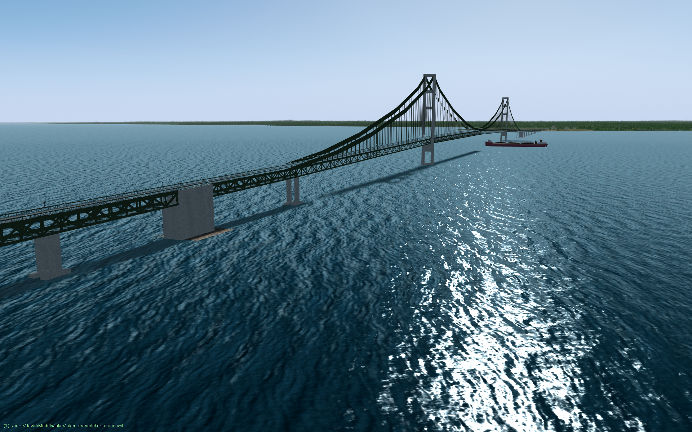
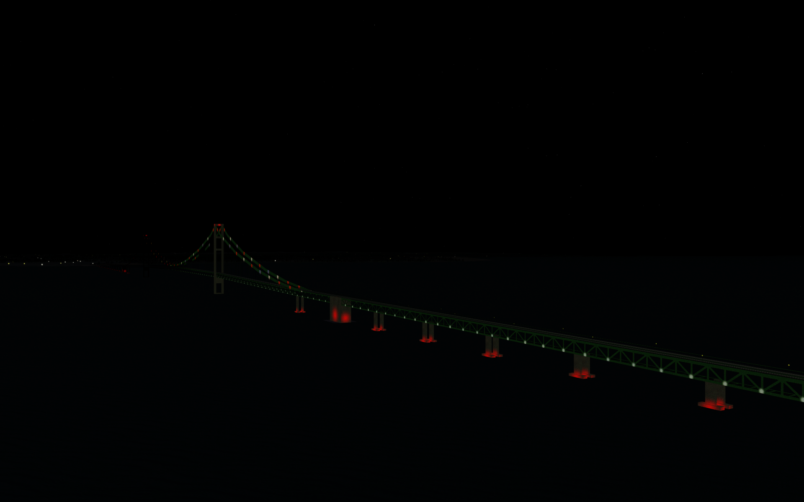

3D model of the Mackinac Bridge
===============================

Low-polygon model of the Mackinac Bridge, for use in flight simulators and similar applications.

## Author

Created by David Megginson, September/October 2024.

## UNLICENSE

This model is in the public domain.  See UNLICENSE.md for details.
